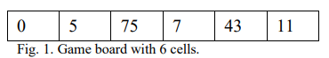

# HW02 - Simplifying Dynamic Programming

Dynamic programming is a technique that can dramatically improve runtime performance. With this assignment, we further explore this technique on a fun problem discussed in their paper, "Simplifying Dynamic Programming," published by Dr. Jamil Saquer and Dr. Lloyd Smith. Specifically, in this assignment, we implement a solution to the "Jump It!" problem.

## Background

Before proceeding with this lab, the student should take the time to read

* [Simplifying Dynamic Programming](sdp.pdf) article (also accessible via Brightspace > CSC232-A > Handouts)
* [Chapter 5 Recursion: The Mirrors](https://msu.vitalsource.com/reader/books/9780138122782/epubcfi/6/124%5B%3Bvnd.vst.idref%3DP70010183410000000000000000017C9%5D!/4/2%5BP70010183410000000000000000017C9%5D/2/2%5BP70010183410000000000000000017CA%5D/7:0%5B%2C%20Re%5D)
* [Chapter 6 Recursion as a Problem-Solving Technique](https://msu.vitalsource.com/reader/books/9780138122782/epubcfi/6/140%5B%3Bvnd.vst.idref%3DP7001018341000000000000000001BD2%5D!/4/2%5BP7001018341000000000000000001BD2%5D/2/2%5BP7001018341000000000000000001BD3%5D/7:0%5B%2CRec%5D)

The following background material is taken directly from the "Simplifying Dynamic Programming" article for your convenience._

### The Jump It! Game

The "Jump It" game consists of a board with _n_ cells or
columns. Each cell, except the first, contains a positive integer
representing the cost to visit that cell. The first cell, where the
game starts, always contains zero.  A sample game board where
_n_ is 6 is shown in Fig. 1.




We always start the game in the first column and have two
types of moves. We can either move to the adjacent column or
jump over the adjacent column to land two columns over. The
cost of a game is the sum of the costs of the visited columns.
The objective of the game is to reach the last cell with the
cheapest cost.

In the board shown in Fig. 1, there are several ways to get
to the end. Starting in the first column, the cost so far is 0. One
could jump to 75, then jump to 43, and then move to 11 for a
total of 75 + 43 + 11 = 129. However, a cheaper path would be
to move to 5, jump to 7, then jump to 11, for a total cost of 5 +
7 + 11 = 23. We want to write a solution to this problem that
computes the cheapest cost for a game board represented as an
array. A straightforward recursive solution is as follows:

```python
def jump_it(board):
    # board - list representing playing board
    if len(board) == 1: # if board contains only one cell
        return board[0]
    elif len(board) == 2: # if board contains only two cells
        return board[0] + board[1]
    elif len(board) == 3: # if board contains only three cells
        return board[0] + board[2] # it is always cheaper to jump here
    else:
        # lowest cost if next move is to move to adjacent cell
        cost1 = board[0] + jump_it(board[1:])
        # lowest cost if next move is to jump over adjacent cell
        cost2 = board[0] + jump_it(board[2:])
        return cost1 if cost1 < cost2 else cost2
```

To get a DP solution from the recursive solution, one
should first write a recurrence equation that shows how the
problem is solved in terms of smaller versions of itself. The
recursive part in the `jump_it` function gives us the equation we
want

```text
jump_it(i) = min{board[i] + jump_it(board[i+1:]), board[i] + jump_it(board[i+2:])}
          = board[i] + min{jump_it(board[i+1:]), jump_it(board[i+2:])}
```

This says that the lowest cost for playing the game starting
at cell `i` is the cost for visiting cell `i` plus the minimum of the
lowest costs of playing the game by moving to the adjacent cell
or by jumping one cell over. Now, we can use a table to cache
solutions to sub-problems and follow a bottom up approach to
reach a DP solution.

```python
cost = [] #cache table to store solutions to sub-problems 
def jump_it(board):
    #Dynamic programming implementation
    #board -- list with costs associated with visiting each cell
    n = len(board)
    cost[n -1] = board[n -1] #cost if starting at last cell
    cost[n -2] = board[n -2] + board[n -1] #cost if starting at 
    #cell before last cell
    
    #now populate the rest of the table
    for i in range(n - 3, -1, -1):
        cost[i] = board[i] + min(cost[i + 1], cost[i + 2])
    return cost[0] #cost playing game starting at first cell
```

The cache table, `cost`, is a global list/array that stores
solutions to sub-problems. The actual size of this list is the same
as the size of the game board. The value `cost[i]` gives the
optimal cost of playing the game starting at index i. So, `cost[0]`
is the optimal cost of playing the game starting at the first cell.
Finding the actual optimal path taken from the first cell to the
last can be done by reverse engineering the costs in the list
cost.

## Objective

Upon successful completion of this lab, the student has learned how to

* identify the characteristics of a problem that lends itself to a dynamic programming technique
* device a naive, recursive solution to a problem
* define either a top-down, or bottom-up approach to dynamic programming

## Getting Started

After accepting this assignment with the
provided GitHub Classroom Assignment link, decide how you want to work with
your newly created repository:

- Using Codespaces directly in your web browser that employees the Visual Studio Code online IDE, or
- Using the IDE of your choice on your local machine

### Codespaces

If a Codespace is available for use (and this is your preferred method of development), open your newly created
repository in a Codespace.

At this point, you can skip to [Creating a development branch](#creating-a-development-branch).

### Local Development

Depending upon the IDE of your choice, many of the following steps may be taken within your IDE. It is up to you to
discover these tools (assuming they're available) and learn how to use them appropriately as desired. The following
instructions are assumed to take place within a terminal window. Note: many IDEs provide a terminal window as well.

#### Cloning your repository

The command you use to clone is slightly different depending upon whether
you're using `git` via `https`, `ssh`, or using the GitHub Cli via `gh`.

If you're using the `https` protocol, your clone command is:

```shell
git clone https://github.com/msu-csc232-sp25/<repo-name>.git
```

If you're using the `ssh` protocol, your clone command is:

```shell
git clone git@github.com:msu-csc232-sp25/<repo-name>.git
```

Finally, if you're using the GitHub CLI (`gh`), your clone command is:

```shell
gh repo clone msu-csc232-sp25/<repo-name>
```

After cloning the repository, navigate into the newly cloned repository:

```shell
cd <repo-name>
```

#### Creating a development branch

Next, create a branch named `develop`. Please note: The name of this branch **must** be as specified and will be, to the
grading scripts, case-sensitive.

```shell
git checkout -b develop
```

Make sure you are on the `develop` branch before you get started. Make all your commits on the `develop` branch.

```bash
git status
```

_You may have to type the `q` character to get back to the command line prompt after viewing the status._

## Tasks

This assignment consists of the following tasks:

- Task 1: Solve jump_it! with board of size 1
- Task 2: Solve jump_it! with board of size 2
- Task 3: Solve jump_it! with board of size 3
- Task 4: Solve jump_it! with board containing more than 3 elements
- Task 5: Optimize solution using DP

All work will take place in the [include/csc232](include/csc232.h) header file, as instructed in each task.

### Task 1: Solve jump_it! with board of size 1

As a reminder, be sure you have created and switch to a new branch named `develop`.

1. Locate the `jump_it()` function defined in [include/csc232.h](include/csc232.h).
2. Modify the body of the function so has to handle a game using a board with just one element.
3. When you have completed your work, toggle the `TEST_TASK1` macro from `FALSE` to `TRUE` and test your solution using the `google-tests` target.
4. Once you are satisfied with your results, stage, commit, and push your work to GitHub.

### Task 2: Solve jump_it! with board of size 2

1. Continue to modify the body of the `jump_it()` function so has to handle a game using a board with just two elements.
2. When you have completed your work, toggle the `TEST_TASK2` macro from `FALSE` to `TRUE` and test your solution using the `google-tests` target.
3. Once you are satisfied with your results, stage, commit, and push your work to GitHub.

### Task 3: Solve jump_it! with board of size 3

1. Continue to modify the body of the `jump_it()` function so has to handle a game using a board with just three elements.
2. When you have completed your work, toggle the `TEST_TASK3` macro from `FALSE` to `TRUE` and test your solution using the `google-tests` target.
3. Once you are satisfied with your results, stage, commit, and push your work to GitHub.

### Task 4: Solve jump_it! with board containing more than 3 elements

This will be the final task to implementing a naive, recursive solution to this problem.

1. Continue to modify the body of the `jump_it()` function so has to handle a game using a board with more than three elements.
2. When you have completed your work, toggle the `TEST_TASK4` macro from `FALSE` to `TRUE` and test your solution using the `google-tests` target.
3. Once you are satisfied with your results, stage, commit, and push your work to GitHub.

### Task 5: Optimize solution using DP

In this final task, we implement an optimized solution using a bottom approach to dynamic programming.

1. Locate the `optimizedjump_it()` defined in the [include/csc232.h](include/csc232.h) header file.
2. Using the advice found in "Simplifying Dynamic Programming.pdf" article, implement an optimized solution to this problem. NOTE: This solution will **not** be a recursive solution, and it should employ the (already defined) `cachedCosts` array to store the costs (which is referred to as the "cache cost table" in the reading).
3. When you have completed your work, toggle the `TEST_TASK5` macro from `FALSE` to `TRUE` and test your solution using the `google-tests` target.
4. Once you are satisfied with your results, stage, commit, and push your work to GitHub.

## Submission Details

Before submitting your assignment, be sure you have pushed all your changes to GitHub. If this is the first time you're
pushing your changes, the push command will look like:

```bash
git push -u origin develop
```

If you've already set up remote tracking (using the `-u origin develop` switch), then all you need to do is type

```bash
git push
```

As usual, prior to submitting your assignment on Brightspace, be sure that you have committed and pushed your final
changes to GitHub. Once your final changes have been pushed, create a pull request that seeks to merge the changes in
your `develop` branch into your `trunk` branch.

You can use `gh` to create this pull request right from your command-line prompt:

```bash
gh pr create --assignee "@me" --title "Some appropriate title" --body "A message to populate description, e.g., Go Bills!" --head develop --base trunk --reviewer msu-csc232-sp25/graders
```

An "appropriate" title is at a minimum, the name of the assignment, e.g., `LAB02` or `HW04`, etc.

Once your pull request has been created, submit the URL of your assignment _repository_ (i.e., _not_ the URL of the pull
request) as a Text Submission on Brightspace. Please note: the timestamp of the submission on Brightspace is used to
assess any late penalties if and when warranted, _not_ the date/time you create your pull request. **No exceptions will
be granted for this oversight**.

### Due Date

Your assignment submission is due by 11:59 PM, Saturday, February 8, 2025.

### Grading Rubric

This assignment is worth **5 points**.

| Criteria           | Exceeds Expectations         | Meets Expectations                  | Below Expectations                  | Failure                                        |
|--------------------|------------------------------|-------------------------------------|-------------------------------------|------------------------------------------------|
| Pull Request (20%) | Submitted early, correct url | Submitted on-time; correct url      | Incorrect URL                       | No pull request was created or submitted       |
| Code Style (20%)   | Exemplary code style         | Consistent, modern coding style     | Inconsistent coding style           | No style whatsoever or no code changes present |
| Correctness^ (60%) | All unit tests pass          | At least 80% of the unit tests pass | At least 60% of the unit tests pass | Less than 50% of the unit tests pass           |

^ _The Google Test unit runner will calculate the correctness points based purely on the fraction of tests passed_.

### Late Penalty

* In the first 24-hour period following the due date, this assignment will be penalized 20%.
* In the second 24-hour period following the due date, this assignment will be penalized 40%.
* After 48 hours, the assignment will not be graded and thus earns no points.

## Disclaimer & Fair Use Statement

This repository may contain copyrighted material, the use of which may not
have been specifically authorized by the copyright owner. This material is
available in an effort to explain issues relevant to the course or to
illustrate the use and benefits of an educational tool. The material
contained in this repository is distributed without profit for research and
educational purposes. Only small portions of the original work are being
used and those could not be used to easily duplicate the original work.
